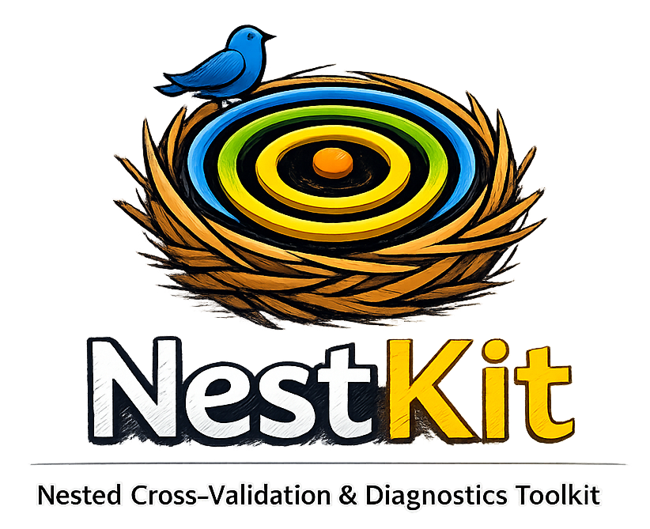

<p align="center">
  
</p>

<p align="center">
  <em>A nested cross-validation toolkit for scikit-learn</em>
</p>

<p align="center">
  <a href="https://pypi.org/project/nestkit/"></a>
  <a href="https://pypi.org/project/nestkit/"></a>
  <a href="https://github.com/ettorerocchi/nestkit/blob/main/LICENSE"></a>
</p>

---

## Motivation

Standard cross-validation conflates model selection with performance estimation, producing optimistically biased scores. When the same data that guides hyperparameter tuning is also used to report performance, the resulting estimates no longer reflect true generalization ability  -  a subtle but pervasive form of data leakage.

**Nested cross-validation** (nested CV) addresses this by separating the two concerns into an inner loop for hyperparameter search and an outer loop for unbiased evaluation. While conceptually simple, implementing nested CV correctly  -  with proper calibration, threshold optimization, and statistical comparison  -  requires careful engineering that is tedious and error-prone to write from scratch.

**nestkit** provides a scikit-learn-compatible implementation that handles the full pipeline: nested CV with integrated probability calibration, decision-threshold optimization, statistical model comparison, hyperparameter stability diagnostics, feature importance aggregation, and visualizations  -  all through a familiar `fit`/`predict` API.

## Key Features

- **Nested cross-validation** for classification and regression with full scikit-learn API compatibility
- **Post-hoc probability calibration**  -  Platt scaling, isotonic regression, beta calibration, and Venn-ABERS prediction
- **Threshold optimization**  -  Youden's J, F-beta, cost-sensitive, balanced accuracy, and precision-at-recall criteria with pooled or fold-specific strategies
- **Statistical model comparison**  -  Nadeau-Bengio corrected t-test, Bayesian correlated t-test with ROPE, and Holm-Bonferroni multi-model correction
- **Hyperparameter stability diagnostics**  -  selection frequency analysis, pairwise Jaccard similarity
- **Feature importance aggregation**  -  cross-fold importance with Nogueira stability index and consensus feature selection
- **Callback system**  -  progress tracking, logging, checkpointing, and custom hooks
- **25+ plotting functions**  -  ROC curves, confusion matrices, calibration diagrams, threshold sensitivity, critical difference diagrams, and more
- **Residual-based prediction intervals** for regression tasks

## Installation

```bash
pip install nestkit
```

Optional dependency groups:

```bash
pip install nestkit[plotting]   # matplotlib + seaborn
pip install nestkit[full]       # plotting + SHAP
pip install nestkit[dev]        # testing + linting
pip install nestkit[docs]       # Sphinx documentation
```

## Quick Start

### Classification

```python
from sklearn.datasets import load_breast_cancer
from sklearn.ensemble import RandomForestClassifier
from nestkit import NestedCVClassifier

X, y = load_breast_cancer(return_X_y=True)

ncv = NestedCVClassifier(
    estimator=RandomForestClassifier(random_state=42),
    param_grid={"n_estimators": [50, 100], "max_depth": [3, 5, 10]},
    outer_cv=5,
    inner_cv=3,
    scoring="accuracy",
    random_state=42,
)
ncv.fit(X, y)

results = ncv.results_
print(results.summary_default_)
print(results.best_params_per_fold_)
```

With calibration and threshold optimization:

```python
ncv = NestedCVClassifier(
    estimator=RandomForestClassifier(random_state=42),
    param_grid={"n_estimators": [50, 100], "max_depth": [3, 5]},
    outer_cv=5,
    inner_cv=3,
    calibration_method="isotonic",
    threshold_strategy="pooled",
    threshold_criterion="youden",
    random_state=42,
)
ncv.fit(X, y)
print(ncv.results_.threshold_comparison())
```

### Regression

```python
from sklearn.datasets import load_diabetes
from sklearn.linear_model import Ridge
from nestkit import NestedCVRegressor

X, y = load_diabetes(return_X_y=True)

ncv = NestedCVRegressor(
    estimator=Ridge(),
    param_grid={"alpha": [0.01, 0.1, 1.0, 10.0]},
    outer_cv=5,
    inner_cv=3,
    prediction_intervals=True,
    random_state=42,
)
ncv.fit(X, y)

results = ncv.results_
print(results.summary_default_)
print(f"PI coverage: {results.prediction_interval_coverage_['mean']:.3f}")
```

## Architecture

nestkit's nested CV procedure executes four phases per outer fold:

1. **Inner CV search**  -  hyperparameter tuning via `GridSearchCV` or `RandomizedSearchCV` on the outer training set
2. **Post-inner processing**  -  probability calibration (classification) or residual collection for prediction intervals (regression)
3. **Refit**  -  the best hyperparameters are used to refit the estimator on the full outer training set
4. **Outer evaluation**  -  the refitted model is scored on the held-out outer test fold

**Class hierarchy:**

| Class | Purpose |
|-------|---------|
| `NestedCVClassifier` | Classification with calibration + thresholding |
| `NestedCVRegressor` | Regression with prediction intervals |
| `ClassifierResults` / `RegressorResults` | Rich result containers |
| `NestedCVComparator` | Statistical model comparison |
| `FeatureImportanceAggregator` | Cross-fold importance analysis |
| `HyperparameterStability` | Selection consistency diagnostics |
| `PostHocCalibrator` | Standalone probability calibration |
| `InnerCVReport` | Inner CV analysis and reporting |

## Documentation

Full documentation is available at the [nestkit documentation site](https://nestkit.readthedocs.io/).

## Citation

If you use nestkit in your research, please cite:

```bibtex
@software{rocchi2026nestkit,
  author       = {Rocchi, Ettore},
  title        = {nestkit: A Nested Cross-Validation Toolkit for Scikit-Learn},
  year         = {2026},
  url          = {https://github.com/ettorerocchi/nestkit},
}
```

## License

MIT  -  see [LICENSE](LICENSE) for details.
